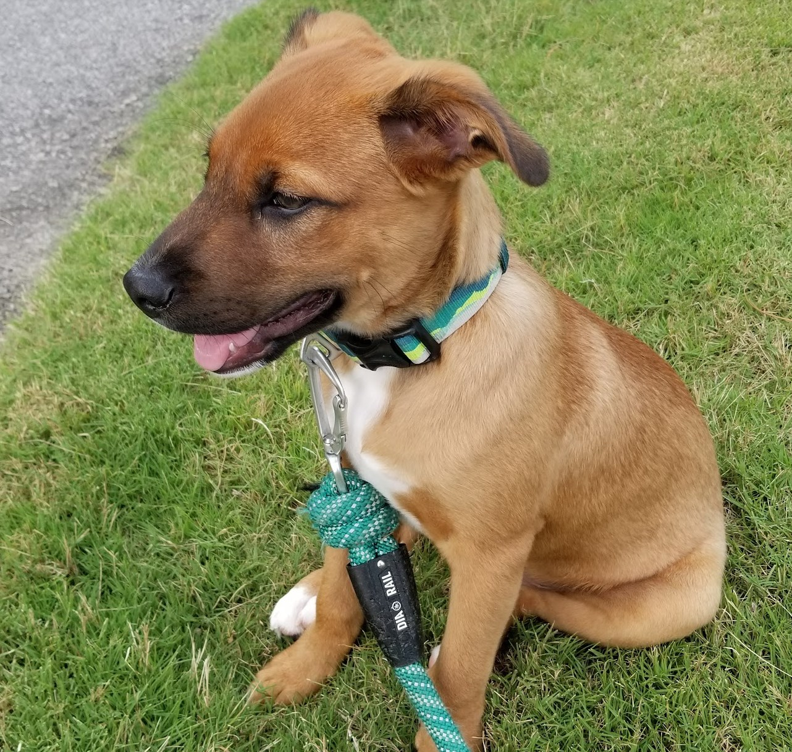

# Build a Blog site with GitHub Page
 
 Note: This post was created like two weeks ago but I missed to sync the file to the repo. Below is a revised version.
 
In the course ST588, we were introduced a quick and easy way to set up blog with GitHub Pages. Here is the instruction given by Chad Baldwin on his blog: [Building a Free Blog with GitHub Pages in Minutes](https://chadbaldwin.net/2021/03/14/how-to-build-a-sql-blog.html).
 
 1. Log in your GitHub account
 2. Clone the [template](https://github.com/chadbaldwin/simple-blog-bootstrap/generate)
 3. Create and name your repo following this format `{your_GitHub_username}.github.io` to ensure the GitHub Pages work
 4. Customize these two files `_config.yml` and `index.md`
 5. Create a markdwon file as a new post 

The blog post markdown files have to be named using this format: `yyyy-mm-dd-your-blog-post-name.md` and saved in `_posts` folder

## The other method
Before coming across this method, I use a `R` package called [`workflowr`](https://github.com/workflowr/workflowr) by [Dr. John Blischak](https://jdblischak.com/workflowr.html). TIt actually is not designed for making blog posts. In fact, this package helps organize data analysis and reports, and make the task workflow reproducible and easy to share with collaborators.
> Reproducible research with workflowr
>
> The workflowr R package combines R Markdown and version control (Git) to create a website containing time-stamped, versioned, and documented results.

## Some updates about my new family member GoGo Pro
Today (June 5), we got the DNA report and that reveals the mysterious origin of our puppy GoGo. His mom is an Austalia cattle dog (aka Australia Heeler) which is no mystery at all. However, no one knows for sure who his dad is. The DNA test has been done in his first vet visit. Couple weeks later, the report finally is here. It turns out he is a mix of Austalia cattle dog (aka Australia Heeler) and Labrador Retriever.

According to Prof. Stanley Coren's book `The Intelligence of Dogs`[^1], Australian cattle dogs rank 10 and Labrador retrievers rank 7. Therefore, GoGo must rank 8.5 on dog intelligency. I feel so lucky I am now in a statistics master program to polish my stats knowledge and skill.

[^1]: [Wiki: The Intelligence of Dogs](https://en.wikipedia.org/wiki/The_Intelligence_of_Dogs)

