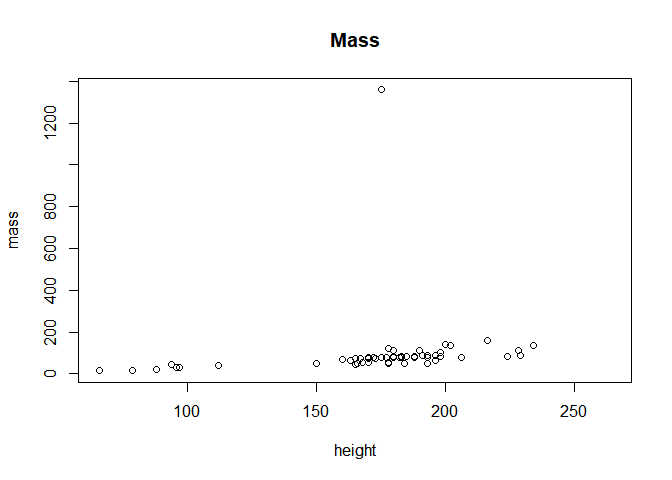
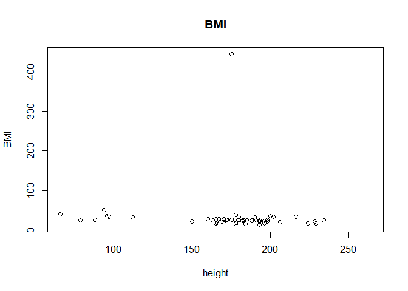

Coolest Things in R
================
Chien-Lan Hsueh
2022-06-29

## Coolest Things in R - Pipes

Compared to other programming languages, R is quite unique in many
aspects. Although it is not designed as a general purposed programming
language, many of its special features have been developed to make
processing data easy. To me, three of the coolest things when
programming in R are pipes, non-standard evaluation (NSE) and list
columns.

### Pipes


Originally from the `maggritr` package, the pipe operator `%>%` has
become one of the most popular features to R users today. It transforms
composite function calls `f(g(h(x)))` into a chained expression
`x %>% h() %>% g() %>% f()`. Instead of having a series of nesting
function calls like this:

``` r
df_nest <- 
  summarise(
    group_by(
      mutate(
        drop_na(starwars, mass, height), 
        BMI = mass / height^2 * 100^2
      ),
      gender
    ),
    BMI_average = mean(BMI)
  )

df_nest
```

    ## # A tibble: 3 × 2
    ##   gender    BMI_average
    ##   <chr>           <dbl>
    ## 1 feminine         19.2
    ## 2 masculine        34.7
    ## 3 <NA>             15.1

we are able to write cleaner codes using the pipe operator:

``` r
df_pipe <- starwars %>% 
  drop_na(mass, height) %>% 
  mutate(BMI = mass / height^2 * 100^2) %>% 
  group_by(gender) %>% 
  summarise(BMI_average = mean(BMI))
df_pipe
```

    ## # A tibble: 3 × 2
    ##   gender    BMI_average
    ##   <chr>           <dbl>
    ## 1 feminine         19.2
    ## 2 masculine        34.7
    ## 3 <NA>             15.1

What makes things better is the other pipe operators provided in the
`maggritr` package. The exposition pipe `%$%` can be handy when using
functions that don’t have built-in data argument (aka
“non-pipe-friendly” functions). For example, to make a scatter plot of
`mass` and `height` variables from `starwars` data set using `plot()`
function, the following code doesn’t work:

``` r
starwars %>% 
  plot(mass, height)
```

To remedy this, we can use the exposition pipe `%$%` to “expose” the
data (the scope of the available variables) to the function on the right
hand side.

``` r
starwars %$% 
  plot(mass, height)
```

<!-- -->

Another useful pipe operator is the tee pipe `%T>%`. It is useful when
you are interested in a side effect from a function and want to chain
the data to more functions afterward. The tee pipe works in a way to
branch out the data flows:

``` r
starwars %>%
  select(height, mass) %T>% 
  # 1st branch
  plot(main = "Mass") %>% 
  # 2nd branch
  mutate(BMI = mass / height^2 * 100^2) %$% 
  plot(height, BMI, main = "BMI")
```

<!-- --><!-- -->

Starting from v4.1, base R supports the native pipe `\>`. It’s not quite
the same with `%>%` yet but I believe the native pipe will improve soon.
Hopefully the variants (like tee and exposition pipes) will also be
included. Both `maggritr` pipes and the native pipe are really cool.
BAM!

### NSE

Non-Standard Evaluation (NSE) is another interesting feature R has. It
is a quite controversial topic in R communities because you rarely see
NSE in other programming languages. Some people like it while some
don’t. For people who don’t but enjoy using `tidyvser`, there is a big
chance that they already use NSE a lot. In the code examples above,
every times we call the functions `group_by()` and `muate()`, we use NSE
for its magic in the background.

Let’s say we want to define a helper function to summarize a variable of
a data frame by group. We want to make the function flexible so that we
can specify the grouping variable as well as the variable to summaries.
Furthermore, we want to use the variable names as the function argument
instead of character variables that store the columns names of interest.
Here is an example of how we can define the helper function with use of
NSE:

``` r
summarise_groups_NSE <- function(df, group, var){
  df %>%
    group_by({{group}}) %>%  
    summarise({{var}} := mean({{var}}, na.rm = TRUE))
}
```

Then we can just use the variable names for the arguments:

``` r
starwars %>% summarise_groups_NSE(gender, height)
```

    ## # A tibble: 3 × 2
    ##   gender    height
    ##   <chr>      <dbl>
    ## 1 feminine    165.
    ## 2 masculine   177.
    ## 3 <NA>        181.

``` r
starwars %>% summarise_groups_NSE(gender, mass)
```

    ## # A tibble: 3 × 2
    ##   gender     mass
    ##   <chr>     <dbl>
    ## 1 feminine   54.7
    ## 2 masculine 106. 
    ## 3 <NA>       48

NSE is extensively used in many functions from `tidyverse` and more and
more new tools are developed with NSE built-in. This is very cool.
Double BAM!!

### List Columns

The last one I would like to include here is list columns. List columns
make it possible to have a data frame object saved in a column of a data
frame resulting in a nested data frame. This is really cool and fun to
use in many applications. For example, read in all Excel spreadsheets at
once:

``` r
# read excel with multiple sheets 
df_raw <- 
  data.frame(sheetname = excel_sheets(excel.file)) %>% 
  mutate(contents = map(sheetname, ~read_excel(excel.file, sheet = .)))
```

The returned data frame has a column `sheetname` of the sheet names and
another column `content` to store the data from each spreadsheet. List
columns are very convenient when used with `Broom` package to tidy up
outputs of many modeling functions. We can easily compare the
performance of each model side-by-side in one master data frame. This is
super cool! Triple BAM!!!
