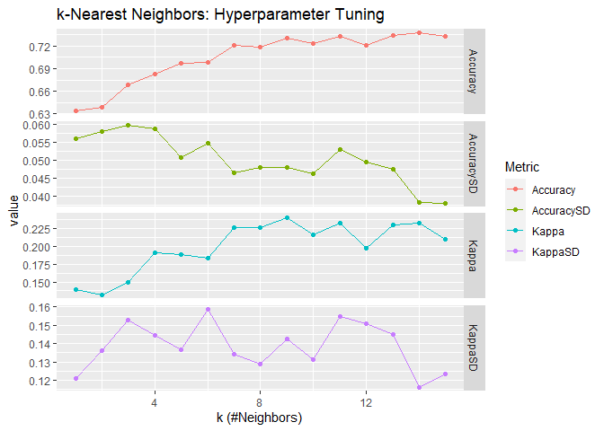
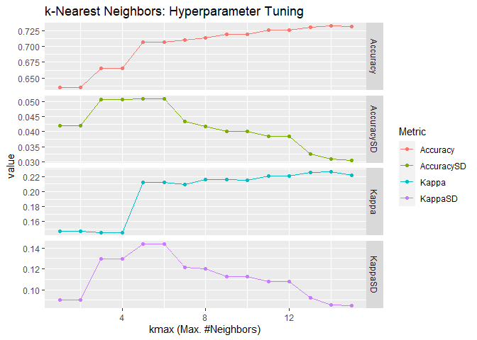

Machine Learning with R
================
Chien-Lan Hsueh
2022-07-17

## Machine Learning with R

In the last decades, there are many newly developed algorithms for
machine learning. Neural networks and ensemble methods are most
attractive to me. Among the tree-based ensemble learning methods we
covered in this course. Random forests is the most interesting one to
me.

Random forests is an ensemble method based on decision trees. It
inherits many advantages from generic tree-based methods including easy
and fast to implement, handling missing values, robust to outliers and
automatic including interactions. Furthermore, it is based on bagging
with randomly selected features in tree creation. This added randomness
reduces the correlation between the sampled trees and effectively
prevents highly correlated trees if there exists a strong predictor. At
work, I use it more and more often to model high dimensional data.

## Example

In this blog, I complete what I left off in ST558 project 2. Because of
the unexpected long computing time and my sidetracking to figure out how
to knit and include child documents in rmarkdown, we didn’t make enough
efforts in explaining the ML methods we used. I will take this chance to
do so while comparing the performance of random forests and a method not
included in the project, K nearest neighbors (KNN).

First, let’s reuse the helper functions we developed in project 2.
`fit_model()` is a wrapper function of `caret::train()` with calculation
of performance metrics (depending on the data type of the response).
Some small modifications are made including making the plot option on by
default in the function call `fit_mode(..., plot = TRUE)` and fixing the
argument orders in `caret::postResample(pred, obs,..)` and
`caret::confusionMatrix(data, reference,..)`.

> Arguments:
>
> -   `formula`: formula
> -   `df_train`: training set
> -   `df_test`: test set
> -   `method`: classification or regression model to use
> -   `preProcess`: pre-processing of the predictors
> -   `trControl`: a list of values that define how train acts
> -   `tuneGrid`: a data frame with possible tuning values
> -   `plot`: whether to plot parameter and metric
> -   `...`: arguments passed to the classification or regression
>     routine
>
> Returned Value: a performance metric (for a numeric response) or
> confusion matrix (for a categorical response)

`plot_modelinfo()` is a helper function called in `fit_model()` to plot
the performance metrics vs. the hyperparameter in modeling tuning
processes. This feature was turned off in the project 2.

> Arguments:
>
> -   `fit`: model fit, a list from the returned class `train`
> -   `plot_wrt`: which hyperparameter to plot (the column location in
>     the `tuneGrid`)

``` r
# a wrapper function to train a model with train set and calculate the model performance on test set
fit_model <- function(
    formula, df_train, df_test, method, 
    preProcess = c("center", "scale"),
    trControl = trainControl(), 
    tuneGrid = NULL, 
    plot = TRUE, ... ){
  
  # timer - start
  proc_timer <- proc.time()
  
  # train model
  fit <- train(
    form = formula,
    data = df_train,
    method = method,
    preProcess = c("center", "scale"),
    trControl = trControl,
    tuneGrid = tuneGrid, ...)
  
  # timer - report time used
  timer <- proc.time() - proc_timer
  print(timer)
  
  # print the best tune if there is a tuning parameter
  if(is.null(tuneGrid)){
    print("No tuning parameter")
  } else {
    # print the best tune 
    print("The best tune is found with:")
    print(glue("\t{names(fit$bestTune)} = {fit$bestTune[1,]}"))
    if(plot) plot_modelinfo(fit)
  }
  
  # make prediction on test set
  pred <- predict(fit, newdata = df_test)
  
  # return performance metric or confusion matrix depending on response type
  if(is.numeric(pred)){
    # numeric response
    performance <- postResample(pred, obs = df_test[, 1])
    # print performance metrics
    print("Performance metrics:")
    print(performance)
    
    # return the performance metric
    return(list(method = method, performance = performance, timer = timer))
    
  } else if(is.factor(pred)){
    # categorical response
    cfm <- confusionMatrix(df_test[, 1], pred)
    # print confusion matrix and accuracy
    print("Confusion table:")
    print(cfm$table)
    print(glue("Accuracy = {cfm$overall['Accuracy']}"))
    
    # return the confusion matrix
    return(list(method = method, performance = cfm, timer = timer))
  }
}

# a helper function to plot the metric vs. the tuning parameter
plot_modelinfo <- function(fit, plot_wrt = 1){
  # get model info
  model <- fit$modelInfo$label
  parameter <- fit$modelInfo$parameters$parameter
  description <- fit$modelInfo$parameters$label
  
  # plot parameter vs metrics
  p <- fit$results %>% 
    select(-setdiff(parameter, names(fit$results)[plot_wrt])) %>% 
    rename_at(1, ~"x") %>% 
    pivot_longer(cols = -1, names_to = "Metric") %>% 
    ggplot(aes(x, value, color = Metric)) +
    geom_point() +
    geom_line() +
    facet_grid(rows = vars(Metric), scales = "free_y") +
    labs(
      title = glue("{model}: Hyperparameter Tuning"),
      x = glue("{parameter} ({description})")
    )
  print(p)
  return(p)
}
```

This time, I use `GermanCredit` data set from `caret` package. Unlike
the numeric response we had in the project 2, the response `Class` is a
categorical response. It is used to classify the bank clients into two
groups based on their credit worthiness: good or bad. After a quick EDA
(not shown here), there are two variables containing only one single
level and thus they are removed. A 70/30 split is used to create
training and test sets.

``` r
data("GermanCredit")

df <- GermanCredit %>% 
  mutate(Class = factor(Class)) %>% 
  relocate(Class) %>% 
  # remove these variables since it only contains one level
  select(-Personal.Female.Single, -Purpose.Vacation)

# split train/test sets
set.seed(90)

trainIndex <- createDataPartition(df$Class, p = 0.7, list = FALSE)
df_train <- df[trainIndex, ]
df_test <- df[-trainIndex, ]
```

Another thing I do differently here is how I save the test results.
Instead of creating separate variables to save the results like we did
in the project 2, a list will be used. This way I can avoid the mistake
we made in the project 2 (forgot to uncomment the random forest result
in the comparison section) by not hard-coded the comparison part.

``` r
# initiate a list to save the results
results <- tibble()
```

### KNN

KKN is a supervised learning algorithm. It calculates distance between
each data point. Some popular distance metrics used in KNN including
Euclidean distance, Manhattan distance, Minkowski distance, cosine
distance and Hamming distance. Then the distances are used to find the
closet neighbors and the classification is decided by majority vote. The
hyperparameter used to tune the models in cross validation is the number
of neighbors (from 1 to 10 in the search grid). To get a fair comparison
for **all** the models included in this study, I use 10-fold cross
validation and repeat it 3 times to search the specified hyperparameter
to get the models with the best performance metric - accuracy. Once the
best model is found, that model is then used to make a prediction on the
test set to test its performance (accuracy again).

The first model is K nearest neighbor (KNN) using `Class::knn()` with
Euclidean distance:

``` r
# configure the model to use
name <- "KNN Euclidean"
method <-  "knn"
tuneGrid <- expand.grid(k = 1:15)

# fit the model
fit <- fit_model(
    Class ~ ., df_train, df_test, method = method,
    trControl = trainControl(method = "repeatedcv", number = 10, repeats = 3),
    tuneGrid = tuneGrid
  )
```

    ##    user  system elapsed 
    ##    6.93    0.12    7.06 
    ## [1] "The best tune is found with:"
    ##  k = 14

<!-- -->

    ## [1] "Confusion table:"
    ##           Reference
    ## Prediction Bad Good
    ##       Bad   18   72
    ##       Good  12  198
    ## Accuracy = 0.72

``` r
# save the result
results <- 
  tibble(
    name = name,
    method = method,
    accuracy = fit$performance$overall["Accuracy"],
    kappa = fit$performance$overall["Kappa"],
    time_elapsed = fit$timer["elapsed"]
  ) %>% 
  bind_rows(results)
```

The second model is still KNN but I use `kknn:kknn()` with Minkowski
distance. Although it is capable to do weighted KNN, I use the standard
un-weighted KNN with `kernel = "rectangular"` for a fair comparison with
the previous KNN model. I also use the default value for the parameter
of Minkowski distance: `distance = 2` which is Euclidean distance.

``` r
# configure the model to use
name <- "KNN Euclidean"
method <-  "kknn"
tuneGrid <- expand.grid(kmax = 1:15, distance = 2, kernel = "rectangular")

# fit the model
fit <- fit_model(
    Class ~ ., df_train, df_test, method = method,
    trControl = trainControl(method = "repeatedcv", number = 10, repeats = 3),
    tuneGrid = tuneGrid
  )
```

    ##    user  system elapsed 
    ##   70.23    0.22   70.53 
    ## [1] "The best tune is found with:"
    ##  kmax = 14
    ##  distance = 2
    ##  kernel = 1

<!-- -->

    ## [1] "Confusion table:"
    ##           Reference
    ## Prediction Bad Good
    ##       Bad   16   74
    ##       Good  12  198
    ## Accuracy = 0.713333333333333

``` r
# save the result
results <- 
  tibble(
    name = name,
    method = method,
    accuracy = fit$performance$overall["Accuracy"],
    kappa = fit$performance$overall["Kappa"],
    time_elapsed = fit$timer["elapsed"]
  ) %>% 
  bind_rows(results)
```

When using the parameter `distance = 1`, the Minkowski distance is the
Manhattan distance:

``` r
# configure the model to use
name <- "KNN Manhattan"
method <-  "kknn"
tuneGrid <- expand.grid(kmax = 1:15, distance = 1, kernel = "rectangular")

# fit the model
fit <- fit_model(
    Class ~ ., df_train, df_test, method = method,
    trControl = trainControl(method = "repeatedcv", number = 10, repeats = 3),
    tuneGrid = tuneGrid
  )
```

    ##    user  system elapsed 
    ##  217.93    0.21  218.23 
    ## [1] "The best tune is found with:"
    ##  kmax = 14
    ##  distance = 1
    ##  kernel = 1

<!-- -->

    ## [1] "Confusion table:"
    ##           Reference
    ## Prediction Bad Good
    ##       Bad   28   62
    ##       Good  15  195
    ## Accuracy = 0.743333333333333

``` r
# save the result
results <- 
  tibble(
    name = name,
    method = method,
    accuracy = fit$performance$overall["Accuracy"],
    kappa = fit$performance$overall["Kappa"],
    time_elapsed = fit$timer["elapsed"]
  ) %>% 
  bind_rows(results)
```

### Random Forests

The third mode is our first random forest model and is done with
`randomForest::randomForest()`. I use same 10-fold cross validation with
3 repeats to search the hyperparameter `mtry`, number of randomly
selected predictors in each tree. The one with best accuracy will then
be used for prediction on the test set to get its performance
(accuracy).

``` r
# configure the model to use
name <- "Random Forests"
method <-  "rf"
tuneGrid <- expand.grid(mtry = 1:15)

# fit the model
fit <- fit_model(
    Class ~ ., df_train, df_test, method = method,
    trControl = trainControl(method = "repeatedcv", number = 10, repeats = 3),
    tuneGrid = tuneGrid
  )
```

    ##    user  system elapsed 
    ##  350.29    3.53  353.93 
    ## [1] "The best tune is found with:"
    ##  mtry = 5

<!-- -->

    ## [1] "Confusion table:"
    ##           Reference
    ## Prediction Bad Good
    ##       Bad   30   60
    ##       Good  10  200
    ## Accuracy = 0.766666666666667

``` r
# save the result
results <- 
  tibble(
    name = name,
    method = method,
    accuracy = fit$performance$overall["Accuracy"],
    kappa = fit$performance$overall["Kappa"],
    time_elapsed = fit$timer["elapsed"]
  ) %>% 
  bind_rows(results)
```

`ranger::ranger()` is another popular implementation of random forests.
It claims to have a faster speed and suitable for high dimensional data.
I keep tuning the same hyperparameter `mtry` and use gini impurity as
the splitting rule. For classification, the default value for
`min.node.size` is 1.

``` r
# configure the model to use
name <- "Random Forests"
method <-  "ranger"
tuneGrid <- expand.grid(mtry = 1:15, splitrule = "gini", min.node.size = 1)

# fit the model
fit <- fit_model(
    Class ~ ., df_train, df_test, method = method,
    trControl = trainControl(method = "repeatedcv", number = 10, repeats = 3),
    tuneGrid = tuneGrid
  )
```

    ##    user  system elapsed 
    ##  157.14    1.67   32.81 
    ## [1] "The best tune is found with:"
    ##  mtry = 10
    ##  splitrule = 1
    ##  min.node.size = 1

<!-- -->

    ## [1] "Confusion table:"
    ##           Reference
    ## Prediction Bad Good
    ##       Bad   32   58
    ##       Good  13  197
    ## Accuracy = 0.763333333333333

``` r
# save the result
results <- 
  tibble(
    name = name,
    method = method,
    accuracy = fit$performance$overall["Accuracy"],
    kappa = fit$performance$overall["Kappa"],
    time_elapsed = fit$timer["elapsed"]
  ) %>% 
  bind_rows(results)
```

### Comparison

Both KNN and random forests use voting and that makes it interesting to
see the comparison. In each learning method, we tune one hyperparameter
in the range of `1:15` using 3 repeats of 10-fold cross validation to
choose the best model with the highest accuracy. The best model is then
used to make predication on test set. We can then compare their accuracy
(together with another performance metric, [Cohen’s
Kappa](https://en.wikipedia.org/wiki/Cohen%27s_kappa)) and the time
used:

``` r
# sort the results
results %>% 
  arrange(desc(accuracy), time_elapsed)
```

    ## # A tibble: 5 × 5
    ##   name           method accuracy kappa time_elapsed
    ##   <chr>          <chr>     <dbl> <dbl>        <dbl>
    ## 1 Random Forests rf        0.767 0.340       354.  
    ## 2 Random Forests ranger    0.763 0.343        32.8 
    ## 3 KNN Manhattan  kknn      0.743 0.282       218.  
    ## 4 KNN Euclidean  knn       0.72  0.176         7.06
    ## 5 KNN Euclidean  kknn      0.713 0.150        70.5

Some findings:

-   `class:knn()` is faster than `kknn:kknn()`
-   `ranger::ranger()` is faster than `randomForest::randomForest()` as
    it claimed
-   Based on accuracy and computing time, `ranger::ranger()` is the best
    method
-   and I sidetracked again and spent too much time on this blog. Need
    to go back to work on ST501 HW7 NOW!
